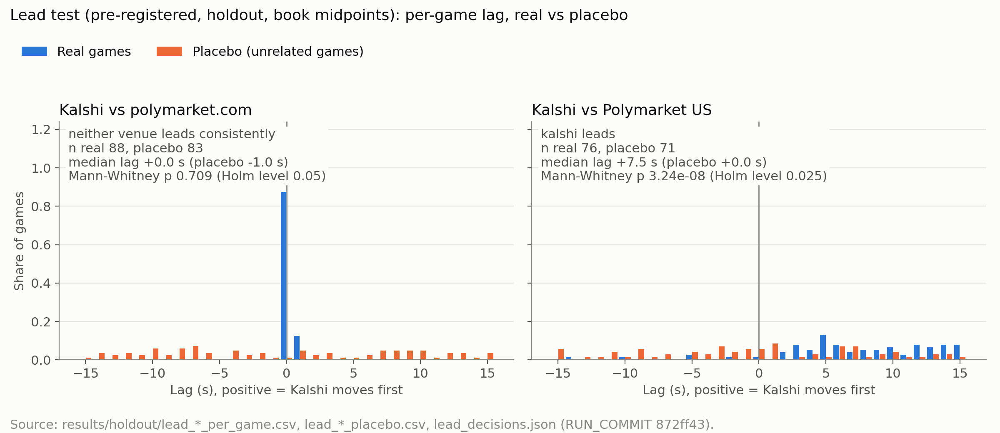
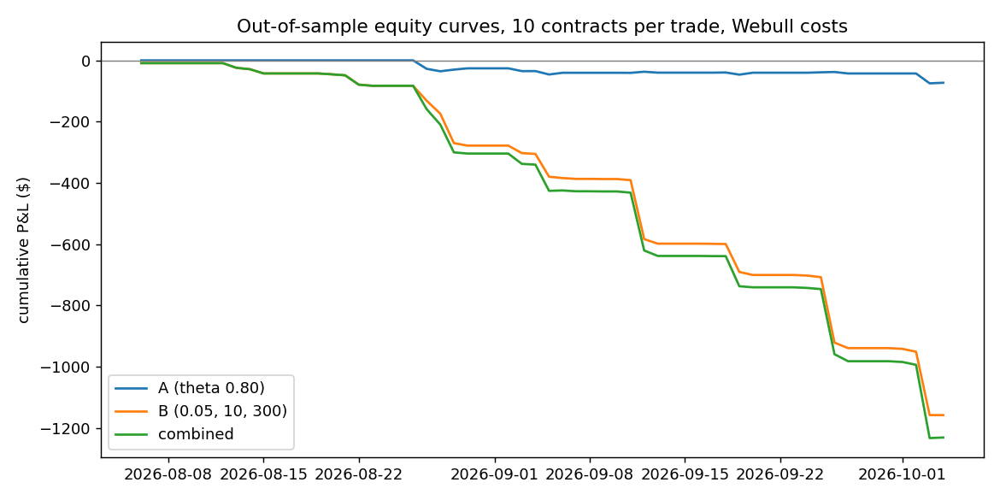

<!-- ══════════════════════════════════════════════════════════════════ -->
<!--  StaleLine · Gator Quant Hacks 2026 · Systematic track              -->
<!--  SVGs in assets/readme/ are built by scripts/make_readme_svgs.py    -->
<!-- ══════════════════════════════════════════════════════════════════ -->

<div align="center">
  
</div>

<div align="center">

[](https://git.io/typing-svg)

[](requirements.txt)
[](requirements.txt)
[](tests/)
[](HYPOTHESIS_v4.md)
[](#-the-rules-we-held-ourselves-to)

**Gator Quant Hacks 2026 · University of Florida · Systematic track**

</div>

<br/>

## 🎯 Now testing: HYPOTHESIS_v4

<div align="center">
  
</div>

**HYPOTHESIS_v4 is our live hypothesis: high risk, high reward, and not yet tested.**

Taking liquidity does not pay after costs, so v4 crosses into largely uncharted territory: is a patient maker paid for
supplying liquidity to recreational sports flow? The reward is an edge that grows with the spread; the risk is one day
of evidence.

<div align="center">
  
</div>

[`HYPOTHESIS_v4.md`](HYPOTHESIS_v4.md) was committed alone to `main` (`94aa1a0`, Oct 4 07:56 ET) before any test data
was opened. It quotes passively on polymarket.com (and on Polymarket US in test set 2), joining the best bid and ask without improving them: 10 contracts,
inventory cap ±50, fills only when a real trade goes through our price. **Arm A** always quotes. **Arm B** quotes only
while the spread is at least 3 c, where the reward per fill is largest. These are v4's own arms, separate from
the v3 strategies in the "Before v4" section below.

<details open>
<summary><b>Where v4 came from (descriptive, one day, not pre-registered)</b></summary>

<br/>

A plain maker simulated on recorded polymarket.com top of book, Oct 3, with the maker fee set to 0. These games fall
in the holdout period, which is disclosed in the branch ledger. Source:
[`posthoc-mm-signal/N_CHECK.md`](https://github.com/katsdivi/GQ-Hacks/blob/posthoc-mm-signal/results/posthoc_mm_signal/N_CHECK.md).

| | Value |
|---|---|
| Games · fills · contracts | 88 · 428 · 4,280 |
| P&L marked to mid at +60 s | **+$46.53** (+1.09 c per contract, 95% CI [+0.17, +2.12]) |
| P&L held to settlement | +$114.03 |
| Share of games positive | 57.6% of the 59 games with fills (38.6% of all 88) |

Excluding the five largest games, the estimate stays positive at +0.15 c per contract [-0.48, +0.77]; this is
condition (2) of v4's own decision rule.

**Divi's reading** (descriptive, one day, not pre-registered): Under our reading rule (games with fills) all four
conditions pass: the +60 s interval excludes zero, so we treat it as a real lead that needs more testing on live games.
The rule was written after these numbers were seen; read over all 88 games (38.6% positive) its game-share condition
fails, which is why the live test decides. Source:
[`N_CHECK.md`](https://github.com/katsdivi/GQ-Hacks/blob/posthoc-mm-signal/results/posthoc_mm_signal/N_CHECK.md)
([`863eb69`](https://github.com/katsdivi/GQ-Hacks/commit/863eb69)).

</details>

---

## 🛰️ How v4 works

<div align="center">
  
</div>

<table>
<tr>
<td width="33%" valign="top">

**🪝 1 · Quote**

Join the best bid and ask, never improve. 10 contracts, inventory cap ±50, no Kalshi signal. Arm B quotes only while the spread is at least 3 c.

</td>
<td width="33%" valign="top">

**🤝 2 · Fill**

A quote fills only when a real trade goes through its price (strict trade-through). Each venue's published maker fee is charged.

</td>
<td width="33%" valign="top">

**📏 3 · Score**

P&L per contract marked to mid at +60 s, game-bootstrap 95% CI (2,000 reps). Supported only if the CI is above 0, the estimate stays above 0 without the top 5 games, and settlement P&L is above 0 (Holm across venues).

</td>
</tr>
</table>

---

## 📚 Before v4: the lead-lag study and the v3 Kalshi strategies (not v4)

> [!IMPORTANT]
> **Nothing in this section is v4. v4 has no negative result: it has not been tested yet.** What follows is the
> finished, confirmatory record of v1 to v3, which asked whether one venue reprices touchdowns before another and
> whether the v3 strategies (mostly liquidity-taking) could trade it. That answer is what pointed us to v4. Full record:
> [`results/posthoc/LEDGER.md`](results/posthoc/LEDGER.md), [`HYPOTHESIS.md`](HYPOTHESIS.md),
> [`HYPOTHESIS_v2.md`](HYPOTHESIS_v2.md), [`HYPOTHESIS_v3.md`](HYPOTHESIS_v3.md) and the note's appendix.

<div align="center">
  
</div>

<div align="center">
  
</div>

> **v3 in one sentence:** we hunted for a betting market that reacts to touchdowns seconds after another one, found one
> that seemed to lag by 7.5 s, and showed the lag was a 30-second web cache, not a market you can beat.

<div align="center">
  
</div>

v3 combined holdout book (not v4): the v3 strategies lost -$1,231.50 on paper after fees.

### 🌀 The v3 plot twist (not v4)

The v3 study's one "win" was Polymarket US apparently trailing Kalshi by **7.5 seconds** (p = 3.2 × 10⁻⁸). Then we
looked at the plumbing. The endpoint the v3 recorder polled every second sits behind Cloudflare with `max-age=30`, so
it was mostly recording the **same snapshot over and over** and timing the cache, not the market.

<div align="center">
  
</div>

v3 laggard on Polymarket US (not v4): fills confirmed by real trades lost -4.09 c per contract [-5.47, -2.37],
because the quote endpoint was cached.

### 📉 The v3 receipts (not v4)

Paper-trading the "slow" venue looked like free money **until each fill was checked against trades that actually
happened**.

<div align="center">
  
</div>

v3 laggard on polymarket.com (not v4): it lost -3.60 c per contract at a 1 s delay [-4.72, -2.58], and more at
every longer delay.

> [!CAUTION]
> **Bottom line of v1 to v3 (not v4).** Kalshi and polymarket.com move together (median lag **0.0 s**, 88 games).
> v3 strategy A (not v4) lost -$73.10 on the holdout, Sharpe -3.81. v3 strategy B (not v4) lost -$1,158.40, Sharpe
> -7.76. **566 trials** in total, lowest Reality Check p **0.4175**: no v3 edge survived. A pre-registered, run-once
> design is built to catch exactly this kind of false positive.

---

## 🔎 Go deeper

<details>
<summary><b>📊 Full v3 holdout results (not v4; pre-registered, run once)</b></summary>

<br/>

**One v3 run · git `872ff43` · 2026-10-04 02:00:23 to 02:32:24 ET · orientation gate PASS (670 games, median 1.01)** ·
[`RUN_LOG.md`](results/holdout/RUN_LOG.md)

| v3 lead test (not v4) | Games | Median lag | Placebo | Mann-Whitney p | Holm level | Decision |
|---|---:|---:|---:|---:|---:|---|
| Kalshi vs polymarket.com | 88 | **0.0 s** | -1.0 s | 0.709 | 0.05 | neither venue leads |
| Kalshi vs Polymarket US | 76 | **+7.5 s** | 0.0 s | 3.24e-08 | 0.025 | Kalshi leads (cache artifact, see above) |

| v3 strategy (not v4; 10 contracts, Webull costs) | Trades | Net result | 95% CI | Sharpe (ann.) |
|---|---:|---|---|---:|
| v3 trade-the-laggard, polymarket.com, 1 s | 521 | **-3.60 c** / contract | [-4.72, -2.58] | |
| v3 trade-the-laggard, Polymarket US, 0 s (polled quotes) | 1,688 | +1.55 c / contract | [+0.99, +2.07] | |
| v3 A, favorite-longshot, theta 0.80 (P&L -$73.10) | 263 | ROC **-3.0%** | [-6.9%, +0.6%] | -3.81 |
| v3 A-maker, theta 0.80 | 9 fills / 314 | ROC **-15.0%** | [-49.6%, +11.1%] | |
| v3 B, cross-venue disagreement (5 c, 10 s, 300 s) (P&L -$1,158.40) | 2,478 | **-4.67 c** / contract | [-4.98, -4.36] | -7.76 |
| **Combined v3 book (A + B)** | 2,741 | **-$1,231.50** | max drawdown $1,224 | **-7.78** |

v3 strategy A (not v4) returned -3.0% on capital. v3 A-maker (not v4) returned -15.0% on 9 fills. v3 strategy B (not
v4) lost -4.67 c per contract.




<sub>Sources: `results/numbers.json` (`OOS.lead.*`, `OOS.A.*`, `OOS.A_maker.*`, `OOS.B.*`, `OOS.combined.*`),
`results/holdout/laggard_latency_curve.csv`. Block bootstrap by game, 2,000 reps. With Kalshi direct fees instead of
Webull, v3 A (not v4) returned -1.5% and v3 B (not v4) lost -3.45 c. With costs doubled, v3 B (not v4) lost -9.67 c.</sub>

</details>

<details>
<summary><b>🌀 The v3 cache diagnostics, in detail (not v4)</b></summary>

<br/>

Post-run and exploratory: they change no pre-registered result. Full write-up in
[`results/holdout_diag/`](results/holdout_diag/README.md).

- **h1** · The polled book endpoint returns `Cache-Control: public, max-age=30`, `cf-cache-status: HIT`, `Age` 1 to 29 s.
- **b** · Polymarket US rows carry no venue timestamp (`src_ts_ns` null in all 317,105 rows), so true venue lag is not
  measurable from what we recorded.
- **h2 to h5** · Against the venue's own time-and-sales file, receipt lagged the venue's trade time by a median
  **19.2 s**. Only **2.3%** of v3 paper fills had a real print at our price or better on both legs.
- v3 laggard on Polymarket US (not v4): on those 14 confirmed fills it lost -4.09 c per contract [-5.47, -2.37].

</details>

<details>
<summary><b>🔬 Everything else tried after v3 (post-hoc, training data only, not v4)</b></summary>

<br/>

Each search had a spec committed before it ran, and a cumulative multiple-testing correction. Commits for every branch
are in [`results/posthoc/LEDGER.md`](results/posthoc/LEDGER.md).

| Post-hoc family (not v4) | Trials | Best in-sample | Verdict |
|---|---:|---|---|
| Fixed grid search | 54 | +0.19 [-0.12, +0.55], 109 trades | Reality Check p 0.99 |
| Cost-side ideas from the literature | 180 | +0.14, 17 trades | RC p 0.45 |
| Maker spread capture | 36 | +3.8% [-4.8%, +10.9%] | no CI above 0 |
| Pattern mining | 57 | +0.09 [-0.07, +0.23], 34 trades | no CI above 0 |
| Unsupervised regimes | 64 | +0.04 [-0.03, +0.08] | RC p 0.45 |
| Residual regression | 48 | +0.01 [-0.04, +0.06] | RC p 0.42 |
| Lead-lag round 2 | 40 | +0.61 [-0.04, +1.27], 11 trades | RC p 0.468 over 479 trials |
| Frozen-encoder ML heads | 2 | ROC -0.08 | lose |
| Kalshi vs CME (Databento) | 18 descriptive cells | -1.5 c | gate failed |

Post-hoc ML heads (not v4) returned -0.08 on capital. Post-hoc Kalshi vs CME cells (not v4) lost -1.5 c per contract.
Plus the 77 rows in [`experiments/variants.csv`](experiments/variants.csv) and smaller branches, for **566 trials in
total**.

</details>

<details>
<summary><b>⚙️ Reproduce it</b></summary>

<br/>

```bash
pip install -r requirements.txt          # pinned: pandas 2.3.2, numpy 1.26.4

python make_sample.py --plot             # synthetic game: 15 planted jumps, follower lags by 2 s
pytest -q                                # 228 tests: lead-lag, holdout files, book wipes, placebo

scripts/reproduce_training.sh            # runs A, B and the book report,
                                         # diffs results/numbers.json against the committed file (233/233)
python scripts/numbers_sheet.py          # results/numbers.json -> docs/note/numbers_sheet.md
python scripts/make_readme_svgs.py       # rebuilds the graphics on this page from committed files
```

Raw vendor data is **not** in the repository (licenses). Rebuild it with `python -m ingest.kalshi_only_train`,
`python -m ingest.download_all`, `python -m ingest.kalshi_market_meta`, `python -m ingest.french_factors`, then
`python scripts/build_b_games_espn.py`. The holdout run is `scripts/final_test_run.py --i-am-the-one-run`, which refuses
to run twice; `--dry-run` runs the same pipeline on synthetic fixtures.

</details>

<details>
<summary><b>🧬 Tick format (every venue, one schema)</b></summary>

<br/>

`data/ticks/<game_id>.parquet`, price always meaning **P(home team wins)**:

| column | meaning |
|---|---|
| `ts` | UTC nanoseconds (int64) |
| `venue` | `kalshi` / `polymarket` / `polymarket_us` (`cme` for the retired v1) |
| `market_id` | the venue's own symbol or ticker |
| `kind` | `trade` / `bid` / `ask` |
| `price` | 0 to 1; away-team contracts flipped with `1 - p` at ingest, bid/ask and side swapped with them |
| `size` | contracts |
| `side` | `buy` / `sell` / `unknown` (aggressor for trades) |

All cross-venue joins are `merge_asof(direction="backward")`: a decision at `t` sees only rows with `ts <= t`.

</details>

<details>
<summary><b>🗂️ Repo map</b></summary>

<br/>

```
staleline/
├── HYPOTHESIS*.md            pre-registrations (v1 CME, v2 lead test, v3 strategies, v4 passive maker)
├── leadlag.py  laggard.py    lead test and trade-the-laggard
├── strategy_a*.py  strategy_b.py  costs.py      strategies and the fee model
├── collector/                live recorders (Kalshi ws, polymarket.com ws, Polymarket US poll), heartbeats
├── ingest/                   historical pulls: Kalshi, polymarket.com, Databento CME, ESPN, French factors
├── scripts/                  final_test_run.py, holdout_diag.py, numbers_sheet.py, make_readme_svgs.py
├── execution/                Webull paper-order client (sandbox host only)
├── experiments/variants.csv  every parameter combination ever run on training data
├── results/
│   ├── numbers.json          every reported number, with the script that produced it
│   ├── holdout/              THE run: RUN_LOG.md, checklist, per-test and per-strategy tables
│   ├── holdout_diag/         post-run diagnostics (the cache finding)
│   └── posthoc/              post-hoc summaries and LEDGER.md
├── assets/readme/            the animated SVGs on this page
├── docs/                     build plan, stats plan, holdout disclosure, known limitations, reviews
├── paper/                    figures and numbers.tex for the quant note
└── tests/                    pytest suite
```

</details>

---

## 🛡️ The rules we held ourselves to

<div align="center">

| | Rule | What it means |
|:---:|---|---|
| ⏱️ | **No lookahead** | a decision at `t` only sees data up to `t`; fills land at `t + latency` |
| 🔒 | **Sealed holdout** | backtest code refuses Aug to Oct 2026 games without the final-run flag |
| 📜 | **Pre-registered** | [`v2`](HYPOTHESIS_v2.md), [`v3`](HYPOTHESIS_v3.md), [`v4`](HYPOTHESIS_v4.md): every rule and amendment a dated commit before its test |
| 🧾 | **Every variant logged** | [`variants.csv`](experiments/variants.csv) and the [post-hoc ledger](results/posthoc/LEDGER.md); rows never deleted |
| 💸 | **Costs always on** | fees, spread and latency in every number, plus a costs x2 line |
| 📝 | **Paper only** | no code path places a real order; the Webull client refuses non-sandbox hosts |

</div>

Known limitations: [`docs/known_limitations.md`](docs/known_limitations.md) · full run disclosure:
[`docs/holdout_run_disclosure.md`](docs/holdout_run_disclosure.md)

---

## 👥 Team

<div align="center">

| 🛠️ | 📐 | 💵 | 🎨 |
|:---:|:---:|:---:|:---:|
| **Divyam Kataria**<br/>[@katsdivi](https://github.com/katsdivi) | **Alden** | **Andrew** | **Olmer** |
| code, data, infrastructure | math spec, stats plan,<br/>hand-checks every number | fees, Webull,<br/>research, quant note | demo app and visuals |

</div>

<div align="center">
  
</div>
