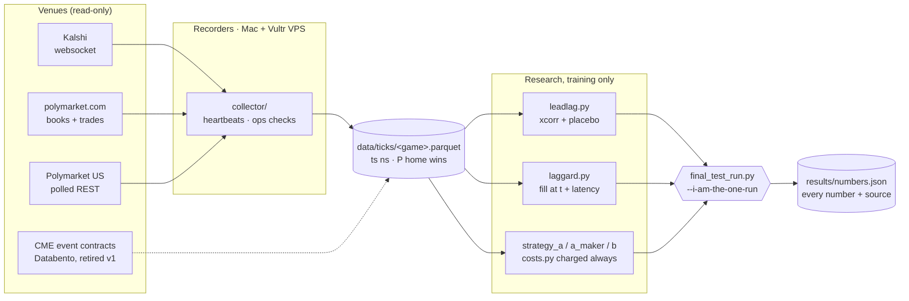
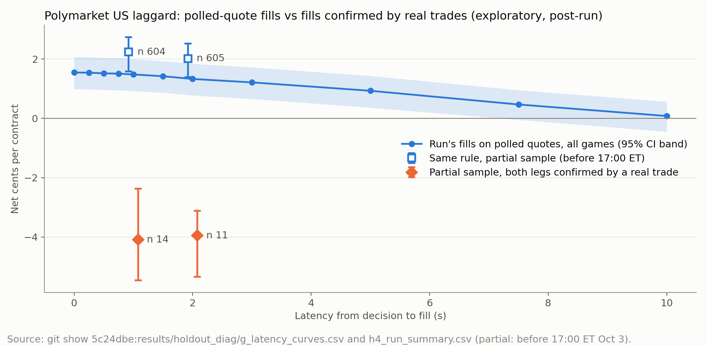

<!-- ══════════════════════════════════════════════════════════════════ -->
<!--  StaleLine · Gator Quant Hacks 2026 · Systematic track              -->
<!-- ══════════════════════════════════════════════════════════════════ -->

<div align="center">
  
</div>

<div align="center">

[](https://git.io/typing-svg)

[](requirements.txt)
[](requirements.txt)
[](HYPOTHESIS_v3.md)
[](results/holdout/RUN_LOG.md)
[](experiments/variants.csv)
[](#-rules-we-held-ourselves-to)

**Gator Quant Hacks 2026 · University of Florida · Systematic track**

</div>

<br/>

> [!IMPORTANT]
> **The short version.** We recorded the same college and NFL games on Kalshi, polymarket.com and Polymarket US, froze a
> lead-lag hypothesis and three strategies, tuned only on games before Aug 1 2026, and then opened the sealed holdout
> **once**. Kalshi and polymarket.com move together (median lag 0.0 s). Polymarket US *looked* 7.5 s behind
> (p = 3.2e-8), but the endpoint we polled turned out to be a Cloudflare cache with `max-age=30`. Every strategy lost
> money after fees, spread and latency. We report all of it.

<br/>

## 📍 Contents

<div align="center">

[Idea](#-the-idea) · [Pipeline](#-pipeline) · [Results](#-holdout-results) · [The cache twist](#-the-twist-a-30-second-cache) · [Everything we tried](#-everything-else-we-tried) · [Reproduce](#-reproduce) · [Repo map](#-repo-map) · [Rules](#-rules-we-held-ourselves-to) · [Team](#-team)

</div>

---

## 💡 The idea

The same football game trades on several venues at once. If one venue reprices a touchdown a few seconds after another,
a fast trader can lift the stale quote on the slow venue before it catches up. **StaleLine** asks three questions:

1. **Does one venue lead?** Per-game cross-correlation of book midpoints, real games vs unrelated-game placebo,
   Mann-Whitney with Holm correction across venue pairs.
2. **Can you trade the laggard?** Paper-trade the slow venue after a jump on the fast one, filling at `t + latency`,
   never at `t`, and plot net edge against assumed reaction delay.
3. **Is there anything else?** Strategy **A** (favorite-longshot taker, theta 0.80), **A-maker** (the same as a passive
   quote) and **B** (cross-venue disagreement, 5 c / 10 s / 300 s), all after Webull's $0.02 per contract per fill,
   spread and latency.

<div align="center">

| | |
|:---:|:---|
| 🧪 **Training** | games with kickoff before **2026-08-01** (179 season days) |
| 🔒 **Holdout** | Aug 1 to Oct 4 2026, sealed until one run on **Oct 4, 02:00 to 02:32 ET** |
| 📜 **Pre-registration** | [`HYPOTHESIS_v2.md`](HYPOTHESIS_v2.md), [`HYPOTHESIS_v3.md`](HYPOTHESIS_v3.md), each amendment a dated commit before the run |
| 🧾 **Ledger** | [`experiments/variants.csv`](experiments/variants.csv) (77 rows) + [`results/posthoc/LEDGER.md`](results/posthoc/LEDGER.md) |

</div>

---

## 🛰️ Pipeline



Every venue is normalized to one tick format, with price always meaning **P(home team wins)**:

| column | meaning |
|---|---|
| `ts` | UTC nanoseconds (int64) |
| `venue` | `kalshi` / `polymarket` / `polymarket_us` (`cme` for the retired v1) |
| `market_id` | the venue's own symbol or ticker |
| `kind` | `trade` / `bid` / `ask` |
| `price` | 0 to 1; away-team contracts flipped with `1 - p` at ingest, bid/ask and side swapped with them |
| `size` | contracts |
| `side` | `buy` / `sell` / `unknown` (aggressor for trades) |

All cross-venue joins are `merge_asof(direction="backward")`: a decision at `t` sees only rows with `ts <= t`.

---

## 📊 Holdout results

<div align="center">

**One run · git `872ff43` · 2026-10-04 02:00:23 to 02:32:24 ET · orientation gate PASS (670 games, median 1.01)**

</div>

### Pre-registered lead test

| Pair | Games | Median lag | Placebo | Mann-Whitney p | Holm level | Decision |
|---|---:|---:|---:|---:|---:|---|
| Kalshi vs polymarket.com | 88 | **0.0 s** | -1.0 s | 0.709 | 0.05 | neither venue leads |
| Kalshi vs Polymarket US | 76 | **+7.5 s** | 0.0 s | 3.24e-08 | 0.025 | Kalshi leads ⚠️ *see below* |

<div align="center">
  
</div>

### Strategies (10 contracts per trade, Webull costs)

| Strategy | Trades | Net result | 95% CI | Sharpe (ann.) |
|---|---:|---|---|---:|
| Trade-the-laggard, polymarket.com, 1 s | 521 | **-3.60 c** / contract | [-4.72, -2.58] | |
| Trade-the-laggard, Polymarket US, 0 s | 1,688 | +1.55 c / contract ⚠️ | [+0.99, +2.07] | |
| A, favorite-longshot, theta 0.80 | 263 | ROC **-3.0%** | [-6.9%, +0.6%] | -3.81 |
| A-maker, theta 0.80 | 9 fills / 314 | ROC **-15.0%** | [-49.6%, +11.1%] | |
| B, cross-venue disagreement | 2,478 | **-4.67 c** / contract | [-4.98, -4.36] | -7.76 |
| **Combined book (A + B)** | 2,741 | **-$1,231.50** | max drawdown $1,224 | **-7.78** |

<div align="center">
  
</div>

<sub>Sources: `results/numbers.json` (`OOS.lead.*`, `OOS.A.*`, `OOS.A_maker.*`, `OOS.B.*`, `OOS.combined.*`) and
`results/holdout/laggard_latency_curve.csv`. Block bootstrap by game, 2,000 reps. With Kalshi direct fees instead of
Webull: A ROC -1.5%, B -3.45 c. Doubling costs: B -9.67 c.</sub>

---

## 🌀 The twist: a 30-second cache

The one positive number, Polymarket US lagging Kalshi by 7.5 s with a +1.55 c laggard edge, did not survive a look at
the plumbing. Post-run diagnostics (exploratory; they change no pre-registered result) are in
[`results/holdout_diag/`](results/holdout_diag/README.md):

- **h1** · The book endpoint the recorder polled returns `Cache-Control: public, max-age=30`, `cf-cache-status: HIT`,
  `Age` from 1 to 29 s. We were measuring Cloudflare's refresh interval, not the market.
- **b** · Polymarket US rows carry no venue timestamp (`src_ts_ns` null in all 317,105 rows), so true venue lag is not
  measurable from what we recorded.
- **h2 to h5** · On the venue's own time-and-sales file, receipt lagged the venue's trade time by a median **19.2 s**.
  Only **2.3%** of paper fills had a real print at our price or better on both legs. On the 14 fills confirmed by real
  trades the edge is **-4.09 c** [-5.47, -2.37].

<div align="center">
  
</div>

> [!NOTE]
> So the honest reading: **we found no venue that is reliably and tradably stale.** The apparent lead was an artifact
> of a cached data source, which is exactly the kind of thing a pre-registered, run-once design is supposed to catch.

---

## 🔬 Everything else we tried

After the holdout we kept searching, on training data only, with a spec committed before each run and a cumulative
multiple-testing correction. Each branch is listed with its spec, code and result commits in
[`results/posthoc/LEDGER.md`](results/posthoc/LEDGER.md).

<div align="center">

| Family | Trials | Best in-sample | Verdict |
|---|---:|---|---|
| Fixed grid search | 54 | +0.19 [-0.12, +0.55], 109 trades | Reality Check p 0.99 |
| Cost-side ideas from the literature | 180 | +0.14, 17 trades | RC p 0.45 |
| Maker spread capture | 36 | +3.8% [-4.8%, +10.9%] | no CI above 0 |
| Pattern mining | 57 | +0.09 [-0.07, +0.23], 34 trades | no CI above 0 |
| Unsupervised regimes | 64 | +0.04 [-0.03, +0.08] | RC p 0.45 |
| Residual regression | 48 | +0.01 [-0.04, +0.06] | RC p 0.42 |
| Lead-lag round 2 | 40 | +0.61 [-0.04, +1.27], 11 trades | **RC p 0.468 over 479 trials** |
| Frozen-encoder ML heads | 2 | ROC -0.08 | lose |
| Kalshi vs CME (Databento) | 18 descriptive cells | -1.5 c | gate failed, stage 2 not run |

</div>

On top of the 77 rows in `variants.csv`. No trial produced a confidence interval above zero that held up.

> [!TIP]
> **What's next:** [`HYPOTHESIS_v4.md`](HYPOTHESIS_v4.md) pre-registers a passive two-sided maker on polymarket.com and
> Polymarket US (venue-timestamped websocket this time), frozen on main before any test data was examined. Its
> confirmatory window is **Oct 8 to Oct 13 2026** and runs once after it closes.

---

## ⚙️ Reproduce

```bash
pip install -r requirements.txt          # pinned: pandas 2.3.2, numpy 1.26.4

python make_sample.py --plot             # synthetic game: 15 planted jumps, Kalshi = CME 2 s later
pytest -q                                # unit tests: lead-lag, holdout files, book wipes, placebo

scripts/reproduce_training.sh            # builds .venv-run, runs A, B and the book report,
                                         # diffs results/numbers.json against the committed file
python scripts/numbers_sheet.py          # results/numbers.json -> docs/note/numbers_sheet.md
```

The raw vendor data is **not** in the repository (licenses). Rebuild it with `python -m ingest.kalshi_only_train`,
`python -m ingest.download_all`, `python -m ingest.kalshi_market_meta`, `python -m ingest.french_factors`, then
`python scripts/build_b_games_espn.py`. The holdout run is `scripts/final_test_run.py --i-am-the-one-run`, which refuses
to run twice; `--dry-run` runs the same pipeline on synthetic fixtures.

---

## 🗂️ Repo map

```
staleline/
├── HYPOTHESIS*.md            pre-registrations (v1 CME, v2 lead test, v3 strategies, v4 next window)
├── leadlag.py  laggard.py    lead test and trade-the-laggard
├── strategy_a*.py  strategy_b.py  costs.py      strategies and the fee model
├── collector/                live recorders (Kalshi ws, polymarket.com, Polymarket US), heartbeats
├── ingest/                   historical pulls: Kalshi, polymarket.com, Databento CME, ESPN, French factors
├── scripts/                  final_test_run.py, holdout_diag.py, numbers_sheet.py, reproduce_training.sh
├── execution/                Webull paper-order client (sandbox host only)
├── experiments/variants.csv  every parameter combination ever run on training data
├── results/
│   ├── numbers.json          every reported number, with the script that produced it
│   ├── holdout/              THE run: RUN_LOG.md, checklist, per-test and per-strategy tables
│   ├── holdout_diag/         post-run diagnostics (the cache finding)
│   └── posthoc/              post-hoc summaries and LEDGER.md
├── docs/                     build plan, stats plan, holdout disclosure, known limitations, reviews
├── paper/                    figures and numbers.tex for the quant note
└── tests/                    pytest suite
```

---

## 🛡️ Rules we held ourselves to

<div align="center">

| | Rule |
|:---:|---|
| ⏱️ | **No lookahead.** Backward as-of joins only; fills at `t + latency`, never at `t`. |
| 🔒 | **Sealed holdout.** Backtest and tuning code refuse test games without the final-run flag. |
| 🧾 | **Every variant recorded.** Never delete a row from `variants.csv`. |
| 💸 | **Costs always charged.** Fees, spread and latency in every number, plus a costs x2 line. |
| 🔑 | **No secrets, no vendor data in git.** `.env`, `data/`, `out/`, `secrets/` are gitignored. |
| 📝 | **Paper trading only.** No code path places a real order; Webull client refuses non-sandbox hosts. |

</div>

Known limitations are listed in [`docs/known_limitations.md`](docs/known_limitations.md) and the full run disclosure in
[`docs/holdout_run_disclosure.md`](docs/holdout_run_disclosure.md).

---

## 👥 Team

<div align="center">

| | | |
|:---:|:---|:---|
| 🛠️ | **Divyam Kataria** ([@katsdivi](https://github.com/katsdivi)) | code, data, infrastructure |
| 📐 | **Alden** | math spec, statistics plan, hand checks on every number |
| 💵 | **Andrew** | fees, Webull, research, quant note |
| 🎨 | **Olmer** | demo app and visuals |

</div>

<div align="center">
  
</div>
